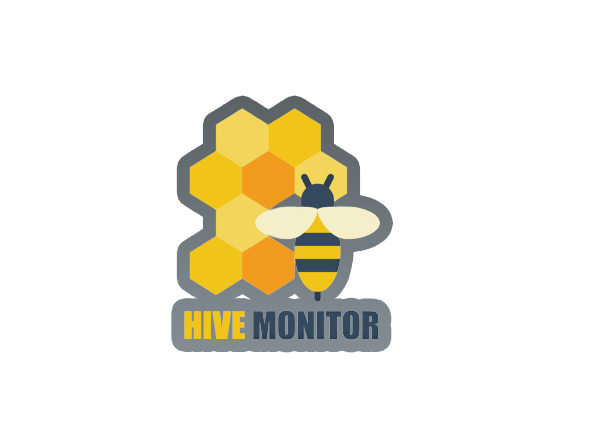
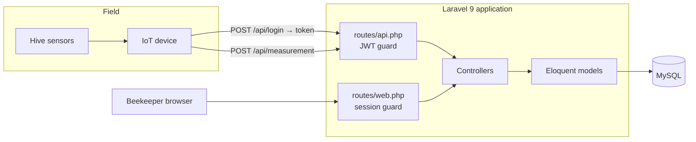

<p align="center">
  
</p>

<h1 align="center">HiveMonitor</h1>

<p align="center">
  <strong>Remote beehive monitoring for beekeepers.</strong><br>
  A Laravel dashboard for managing apiaries, paired with a token-authenticated API
  that IoT devices use to report hive sensor readings.
</p>

<p align="center">
  
  
  
  
</p>

<p align="center">
  
  
  
  
  
</p>

<p align="center">
  
  
</p>

---

## Overview

Beekeepers cannot inspect every hive every day, and opening a hive to check it is itself disruptive. HiveMonitor addresses that by letting sensor devices installed in the hives report their readings continuously, so the colony's condition can be followed from a browser.

The application has two halves that share one database:

- **A web dashboard** for beekeepers — manage apiaries, beehives, sites, inspection records and tasks, and view charted sensor readings.
- **A REST API** for hardware — devices authenticate with a JWT and POST measurements (temperature, humidity, weight, sound, pressure, external temperature).

## Architecture



**The two authentication paths are separate and must not be confused:**

| | Web dashboard | Device API |
|---|---|---|
| Routes | `routes/web.php` | `routes/api.php` |
| Guard | Session (`auth` middleware, `config/auth.php`) | JWT (`jwt.verify` → `app/Http/Middleware/JwtMiddleware.php`) |
| Login | `Auth::routes()`, Argon Blade views | `POST /api/login` → `ApiController::authenticate` |
| Consumer | Beekeeper in a browser | Sensor device / mobile client |

Laravel Sanctum is installed and one stock `/api/user` route uses it, but the device API is JWT-based (`tymon/jwt-auth`). `app/Models/User.php` implements `JWTSubject` with both required methods.

### Domain model

```text
Apiary ──< Beehive ──< Device ──< Sensor ──< Measurement
             │                                    │
           Site                        MeasurementCategory
         Country                        MeasurementUnit
     BeehiveType / BeehiveStatus
```

`Task` and `Inspection` record beekeeper fieldwork against hives.

### Two generations of sensor storage

The codebase contains **two overlapping designs** for readings, both live:

1. **Legacy — one table per quantity.** `temperatures`, `humidities`, `weights`, `sounds`, `pressures`, `exttemperatures`, each with its own model and controller. These are what the JWT-protected endpoints in `routes/api.php` expose today.
2. **Normalized — a single `measurements` table.** `Measurement` references `Device`, `Sensor`, `MeasurementCategory` and `MeasurementUnit`, exposed at `/api/measurement`.

New sensor work should target `Measurement`. The per-quantity controllers are retained for compatibility with existing devices.

## Technology stack

Versions are those pinned in `composer.lock` and `package.json`.

| Layer | Technology |
|---|---|
| Framework | Laravel 9.14.1 (PHP ≥ 8.0.2) |
| Database | MySQL (default); `config/database.php` also defines sqlite, pgsql, sqlsrv |
| API auth | `tymon/jwt-auth` (`dev-develop`) |
| Session auth | Laravel built-in (scaffolding originally generated by `laravel/ui`, since removed) |
| Also installed | `laravel/sanctum` 2.15.1 |
| UI | `laravel-frontend-presets/argon` 1.1.2 — Blade + Bootstrap 5, assets in `public/` |
| Charts | Chart.js, embedded in the Argon theme templates (static data) |
| Maps | Google Maps JavaScript API |
| Asset build | Laravel Mix 6 (webpack), Sass |
| Testing | PHPUnit 9.5 |

> **Declared but unused.** `spatie/laravel-permission` is in `composer.json` but no code references it — roles are not implemented. The Vue 2 toolchain in `package.json` is likewise configured but unused; all UI is server-rendered Blade. `consoletvs/charts` and `laravel/ui` were removed as dead dependencies, so `composer.lock` needs regenerating with `composer update` — see [`docs/AUDIT.md`](docs/AUDIT.md).

## Project structure

```text
HiveMonitor/
├── app/
│   ├── Http/
│   │   ├── Controllers/     # API resource controllers + Blade page controllers
│   │   ├── Middleware/      # incl. JwtMiddleware for the device API
│   │   └── Requests/        # Argon profile/password form requests
│   ├── Models/              # 21 Eloquent models
│   └── Rules/
├── config/                  # incl. jwt.php, permission.php, services.php
├── database/
│   ├── migrations/          # 24 migrations
│   ├── seeders/             # UsersTableSeeder (default admin)
│   └── factories/
├── docs/
│   ├── AUDIT.md             # known issues / maintenance backlog
│   └── images/
├── public/                  # front controller + committed Argon theme assets
├── resources/
│   ├── views/
│   │   ├── layouts/         # Argon shell: navbars, headers, footers
│   │   ├── pages/           # dashboard feature pages
│   │   └── auth/            # login / register / password reset
│   ├── js/  └── sass/       # Mix sources (minimal)
├── routes/
│   ├── web.php              # session-guarded dashboard
│   └── api.php              # JWT-guarded device API
└── tests/
```

## Prerequisites

- PHP **8.0.2 or newer**, with the extensions Laravel 9 requires (`ctype`, `fileinfo`, `json`, `mbstring`, `openssl`, `pdo`, `tokenizer`, `xml`)
- Composer 2
- Node.js and npm (only needed to rebuild Mix assets)
- MySQL 5.7+ / MariaDB

## Installation

```bash
composer install
npm install

cp .env.example .env
php artisan key:generate
php artisan jwt:secret        # writes JWT_SECRET — the API cannot issue tokens without it
```

Create the database named in `DB_DATABASE`, then:

```bash
php artisan migrate
php artisan db:seed           # optional: creates the default admin user
```

> `php artisan jwt:secret` is easy to miss and there is no fallback — `config/jwt.php` reads `JWT_SECRET` with no default. Skipping it leaves every API login failing.

## Configuration

All configuration is read from `.env`. Copy `.env.example` and fill in:

| Variable | Purpose |
|---|---|
| `APP_KEY` | Laravel encryption key — set by `php artisan key:generate` |
| `APP_URL` | Base URL of the application |
| `DB_CONNECTION` / `DB_HOST` / `DB_PORT` / `DB_DATABASE` / `DB_USERNAME` / `DB_PASSWORD` | Database connection |
| `JWT_SECRET` | **Required.** Signing key for the device API — set by `php artisan jwt:secret` |
| `JWT_TTL` | Token lifetime in minutes (default 60) |
| `GOOGLE_MAPS_API_KEY` | Google Maps JavaScript API key for the apiary sites and dashboard maps |
| `MAIL_*` | Outbound mail (password resets) |

Never commit a filled-in `.env` — it is git-ignored. Restrict the Google Maps key by HTTP referrer in the Google Cloud Console; it is served to the browser and is therefore publicly visible by design.

## Running locally

```bash
php artisan serve      # http://127.0.0.1:8000
npm run watch          # rebuild Mix assets on change (separate terminal)
```

Register through the UI, or seed the default admin with `php artisan db:seed` — the seeded credentials are in `database/seeders/UsersTableSeeder.php` and **must be changed before any deployment**.

### API usage

```bash
# Obtain a token
curl -X POST http://127.0.0.1:8000/api/login \
     -d "email=you@example.com&password=yourpassword"

# Use it
curl http://127.0.0.1:8000/api/temperature \
     -H "Authorization: Bearer <token>"
```

| Method | Endpoint | Auth |
|---|---|---|
| POST | `/api/login`, `/api/register` | none |
| GET | `/api/user`, `/api/logout` | JWT |
| GET, POST | `/api/temperature`, `/api/humidity`, `/api/weight`, `/api/sound`, `/api/pressure`, `/api/exttemperature` | JWT |
| PUT | `/api/temperature/{id}` | JWT |
| GET, POST | `/api/measurement`, `/api/site` | **none — see note** |

> `/api/measurement` and `/api/site` sit outside the `jwt.verify` group in `routes/api.php` and are unauthenticated. Preserved as-is because devices may depend on it; flagged in [`docs/AUDIT.md`](docs/AUDIT.md).

## Testing

```bash
vendor/bin/phpunit                                 # whole suite
vendor/bin/phpunit tests/Feature/ExampleTest.php   # one file
vendor/bin/phpunit --filter test_that_true_is_true  # one test
```

Tests run against an in-memory SQLite database (`phpunit.xml`), so they never touch your development data.

> **The suite is stock scaffolding only.** `tests/Unit/ExampleTest.php` asserts `true`, and `tests/Feature/ExampleTest.php` checks that `GET /` returns 200. No controller, model or route has test coverage.

There is no linter or static analyser configured. `.styleci.yml` configures StyleCI (Laravel preset) as a hosted service, and `.editorconfig` sets 4-space indentation, LF endings and trailing-whitespace trimming.

## Build

```bash
npm run dev     # development build
npm run watch   # rebuild on change
npm run prod    # minified production build
```

Mix compiles `resources/js/app.js` and `resources/sass/app.scss` into `public/js` and `public/css`.

> **`npm run prod` currently fails on a clean install.** No `package-lock.json` is committed, so npm resolves a webpack version newer than `laravel-mix@6` supports and the build dies with `Cannot find module 'webpack/lib/SizeFormatHelpers'`. Installing `webpack@5.89.0` works around it. Details and permanent fixes are in [`docs/AUDIT.md`](docs/AUDIT.md).
>
> This does **not** block running the application: the theme it actually renders is the pre-built Argon asset tree already committed under `public/argon/` and `public/assets/`. The Mix pipeline is essentially unused.

## Deployment

**No deployment configuration exists in this repository** — there is no Dockerfile, no `docker-compose.yml`, no CI workflow, and no cloud or infrastructure-as-code configuration. Deployment would follow the standard Laravel process (web server pointed at `public/`, `.env` provisioned, `composer install --no-dev`, `php artisan config:cache`), but nothing here is set up or verified, so no specific process is documented.

Only a **local development** environment exists. There is no test, staging or production environment configured.

## Known limitations

This is a final-year project (PFE) and parts of it are incomplete. The significant ones:

- **Roles and permissions are not implemented.** The Role/Add-role pages are static mock-ups. `spatie/laravel-permission` is installed but its migration was never published and `User` does not use `HasRoles`.
- **Around ten controllers are unreachable** — `SensorController`, `DeviceController`, `CountryController`, `SettingController` and others have full CRUD methods but no routes.
- **Model/column mismatches remain** — several models declare `$fillable` fields with no matching database column, so those values are silently dropped.
- **The `settings` table has no columns** beyond `id` and timestamps, so `SettingController` cannot function.
- **No seed data for lookup tables** (`beehive_types`, `beehive_statuses`, `countries`, `measurement_units`, `measurement_categories`), which the `beehives` foreign keys require — these must be populated before a hive can be created on a fresh database.

Every known issue is catalogued with file and line references in **[`docs/AUDIT.md`](docs/AUDIT.md)**.

## Troubleshooting

| Symptom | Cause |
|---|---|
| API login returns a token error, or every request is rejected | `JWT_SECRET` is empty — run `php artisan jwt:secret` |
| `RuntimeException: No application encryption key` | Run `php artisan key:generate` |
| Migration fails on a foreign key | Migrations must run in filename order on an empty database; use `php artisan migrate:fresh` |
| Maps render blank / "for development purposes only" | `GOOGLE_MAPS_API_KEY` is unset, invalid, or referrer-restricted against your host |
| Cannot create a beehive — foreign key constraint fails | Lookup tables are unseeded (see Known limitations) |
| Styling missing after `npm run prod` | The UI uses `public/argon` and `public/assets`, not Mix output; verify those directories are present |

## License

MIT — see [LICENSE](LICENSE).

---

<p align="center">
  
</p>

<p align="center">
  Built with ❤️ by <strong>Hamdi KHSIB</strong><br>
  <a href="https://github.com/KHSIB-Hamdi">@KHSIB-Hamdi</a>
</p>
